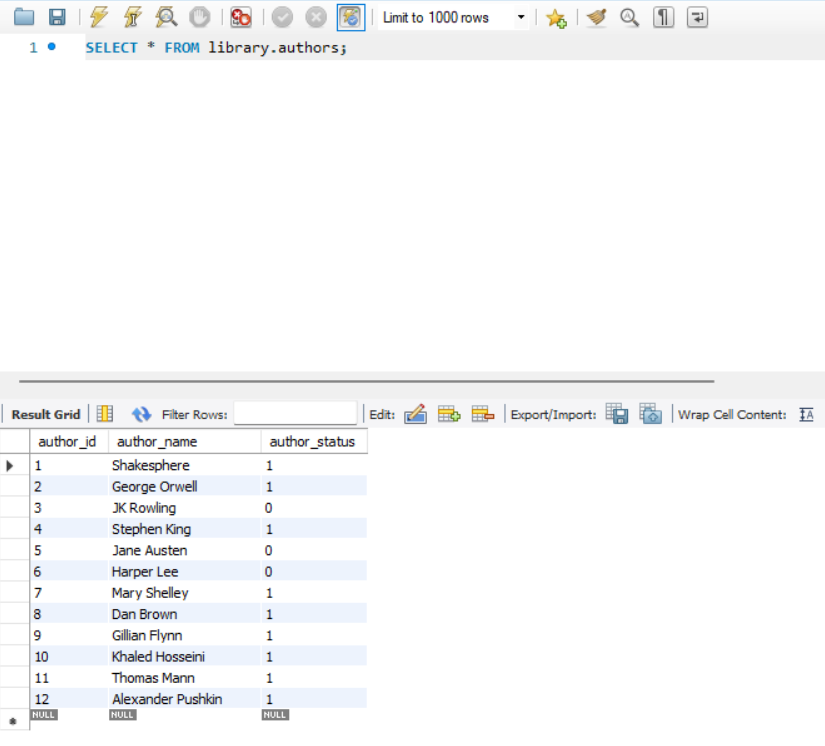
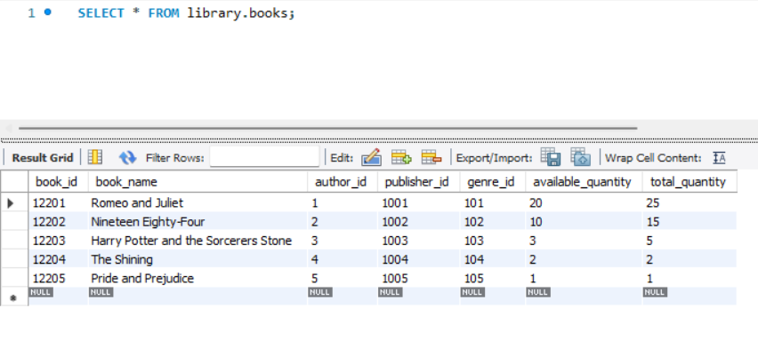
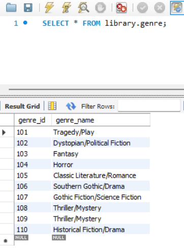
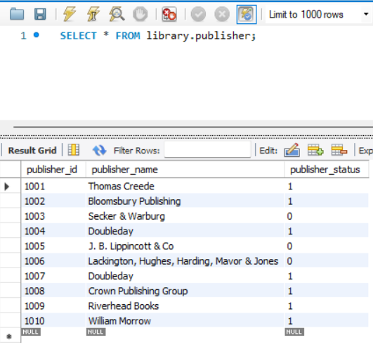
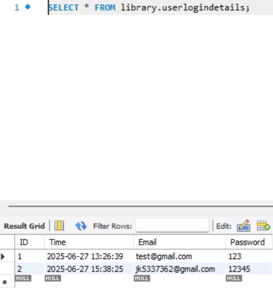

# 📚 eLibrary WinForms Application

A desktop-based eLibrary Management System developed using **C# (.NET WinForms)** and **SQL Server**. The application provides functionalities to manage books, authors, users, and borrowing/returning of books. Suitable for small libraries, schools, or personal collections.

[▶️ Watch the demo video](Library/DemoVideo/ScreenRecording.mp4)
<!--(https://drive.google.com/file/d/1NxXHbb7W1J2OA8mKrdYX5kgUtBCWnCgO/view?usp=sharing)-->

---

## 🚀 Features

- User login with role-based access (admin/users)
- Add, edit, delete ,list operations with authors,books,booking,genre,publisher,user.
- Issue and return books
- Search and filter book,genre,author,publisher records
- SQL Server database integration
- Clean, user-friendly Windows Forms interface

---

## 🛠️ Technologies Used

- **C# (.NET Framework)** – Windows Forms Application
- **SQL Server** – Database backend
- **ADO.NET** – Data access
- **Visual Studio** – Development environment
- **Git/GitHub** – Version control and hosting

---
<!--
## 🧾 SQL Tables & Structure

| 1. `Authors` | 2. `Books`| 3. `Genre`
|:---------------:|:------------:|:------------:|
|  |  |

 3. `Genre` | 4. `Publisher`
 |:---------------:|:------------:|

### 3. `Booking`

### 4. 

### 5. `Publisher`

### 6. `UserDetails`

-->

## 🧑‍💻 What I Did

- Designed and developed the complete frontend using **Windows Forms**
- Created and normalized **SQL Server** tables
- Connected forms to the database using **ADO.NET**
- Implemented **role-based login** and access control
- Added **real-time validations** and **error handling**
- Versioned and hosted the project on **GitHub**

---

## 📬 Contact

If you'd like to collaborate, report bugs, or suggest features, feel free to:

- 📧 Email me at: [pondurijayakrishna@gmail.com](mailto:pondurijayakrishna@gmail.com)
- 🐞 Open an [issue](https://github.com/jayakrishna77/eLibrary-WinForms-CSharp/issues) in this repository

